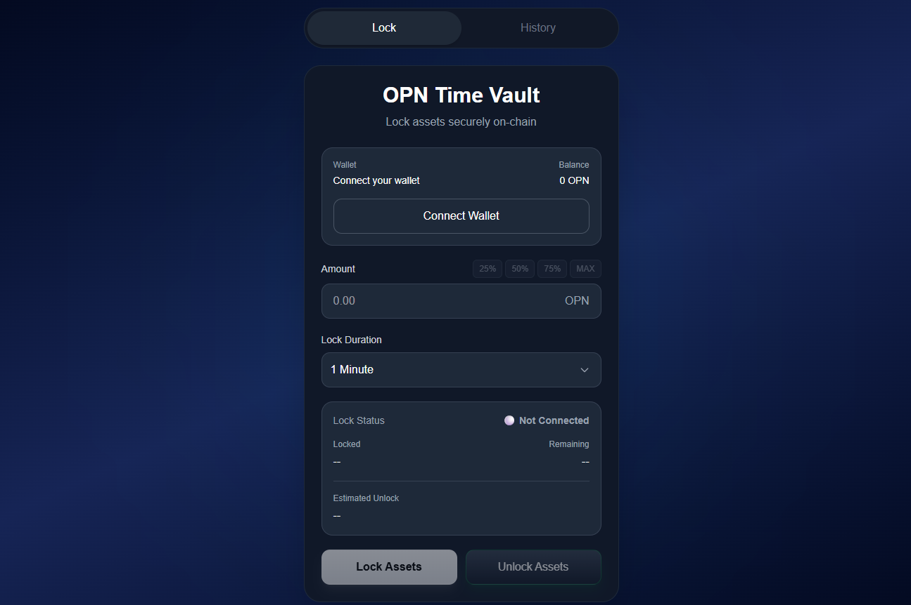
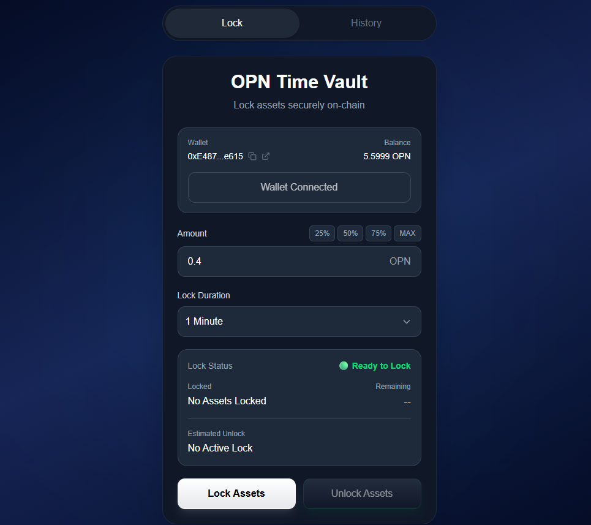
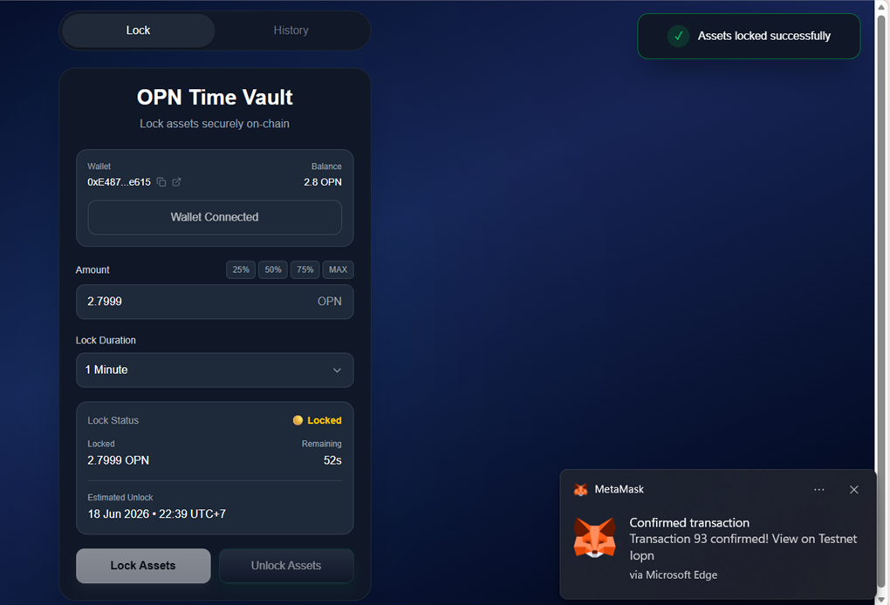
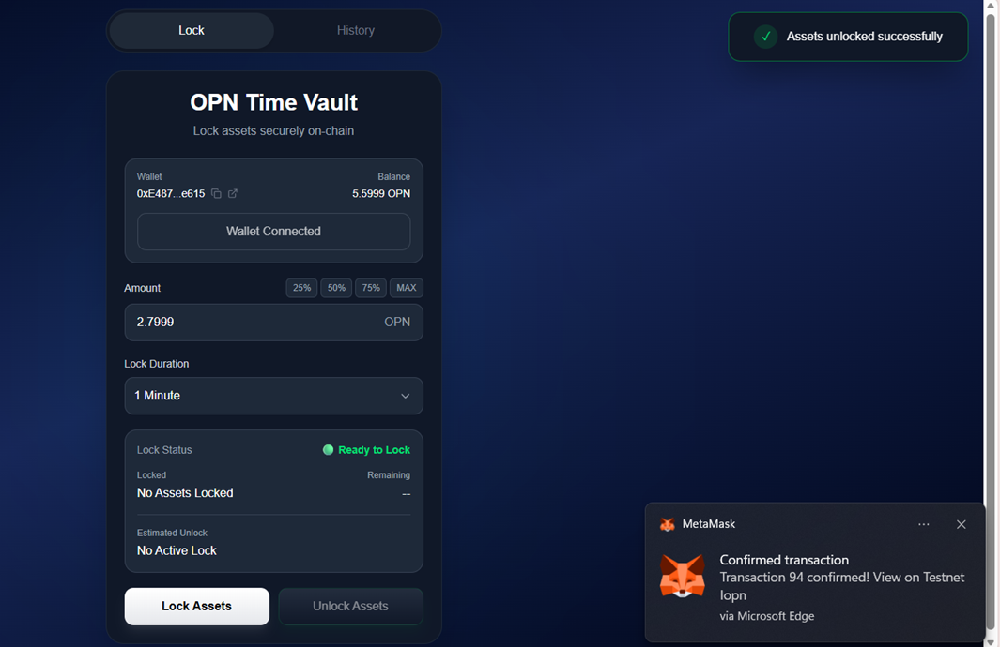
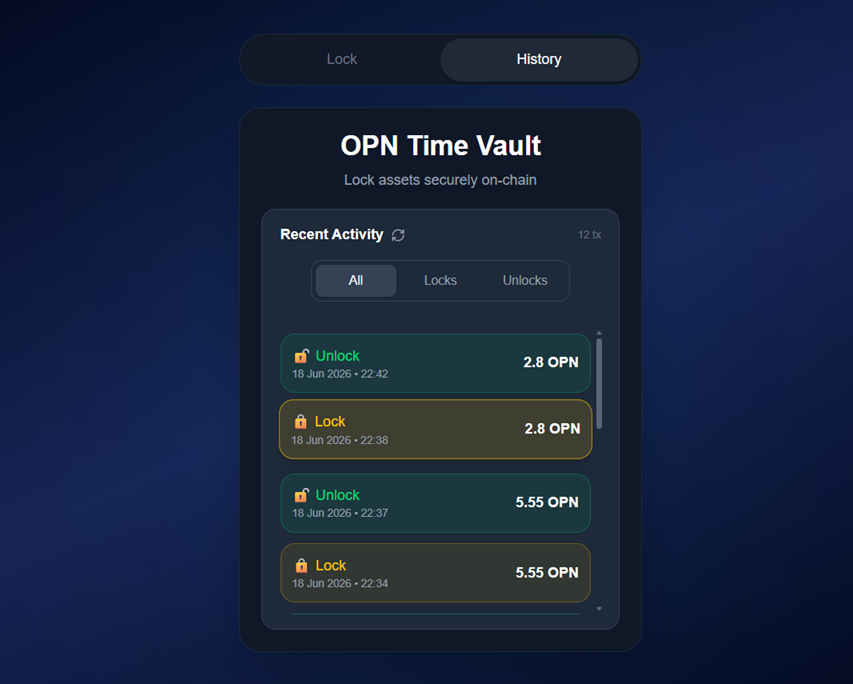

# OPN Time Vault


<p align="center">
  
</p>

A decentralized time-lock vault built on the OPN network.

Users can lock OPN assets for a selected duration, monitor lock status, track transaction history, and unlock assets once the lock period expires.

## 🚀 Live Demo

[Launch Application](https://opn-time-vault.vercel.app)

## ✨ Features

### Core Functionality

- Wallet Connection
- Asset Locking
- Asset Unlocking
- Real-Time Lock Status
- Transaction History

### User Experience

- Explorer Integration
- Network Validation
- Responsive UI
- Local History Caching

## 📸 Screenshots

<h3 align="center">Dashboard</h3>

<p align="center">
  
</p>

<hr>

<h3 align="center">Active Lock</h3>

<p align="center">
  
</p>

<hr>

<h3 align="center">Ready To Unlock</h3>

<p align="center">
  
</p>

<hr>

<h3 align="center">Transaction History</h3>

<p align="center">
  
</p>

## 🛡️ Validation

- Amount must be greater than 0
- Amount cannot exceed wallet balance
- Gas reserve protection
- Network validation
- Lock state validation
- Unlock eligibility validation
- Transaction error handling
- Automatic wallet change detection
- Transaction status notifications

## ⚡ Advanced Features

- Automatic wallet account change detection
- Automatic vault state refresh
- Local transaction history caching
- Manual history refresh
- Transaction history filtering (All / Locks / Unlocks)
- Direct transaction explorer links
- Wallet address copy functionality
- One-click wallet explorer access
- Real-time lock countdown
- Transaction status notifications
- Responsive UI design

## 🛠️ Tech Stack

### Frontend

- Next.js
- TypeScript
- Tailwind CSS
- ethers.js

### Smart Contracts

- Solidity
- EVM Compatible Network

## 🔗 Smart Contract

**Contract Address**

```text
0xd97a6c240c23cf4e0c456dff2f22491070c5d21d
```

**Explorer:**

https://testnet.iopn.tech/address/0xd97a6C240c23cf4E0C456dfF2f22491070C5D21D

## 📦 Getting Started

### Install Dependencies

```bash
npm install
```

### Run Development Server

```bash
npm run dev
```

### Build Production Version

```bash
npm run build
```

### Start Production Server

```bash
npm run start
```

## 📁 Project Structure

```text
frontend/
├── app/            # Application routes and pages
├── components/     # Reusable UI components
├── hooks/          # Custom React hooks
├── lib/            # Wallet, contract and history services
├── constants/      # Network and UI constants
├── types/          # Shared TypeScript definitions
├── utils/          # Formatting and helper functions
├── public/         # Static assets
├── package.json    # Project dependencies
├── next.config.ts  # Next.js configuration
└── tsconfig.json   # TypeScript configuration
```

## 🌐 Deployment

Frontend is deployed on Vercel and connected to the OPN Testnet smart contract.

Production URL:

https://opn-time-vault.vercel.app

## 🚧 Future Improvements

### V2

- Multiple simultaneous locks
- Beneficiary-based time vaults
- Lock extension functionality
- Advanced history filtering

### V3

- Team vesting schedules
- DAO treasury timelocks
- Multi-asset support
- Mainnet deployment

## 📜 License

MIT
